<h1 align="center">Beast Mode Motors — Car Passport</h1>

<p align="center">
  <strong>A verified, transferable history for every car — and a safer way to sell one privately.</strong><br>
  Owners log work as it happens, the shop that did it confirms it with one click, and when the car is sold the whole history moves to the new owner.
</p>

<p align="center">
  
  
  
  
  
  
</p>

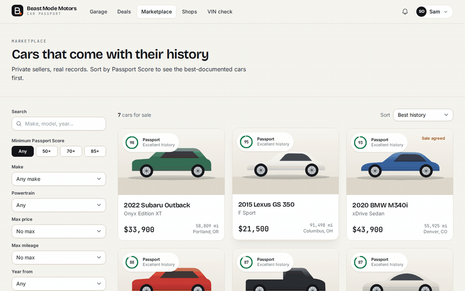

<p align="center"><em>A real sale recorded in the app: the buyer accepts the counter-offer, records the inspection, both sides tick the handover checklist, and the passport moves to the buyer's garage.</em></p>

## The problem

Millions of used cars change hands between private owners every year, and those sales run on trust that nobody can check:

- **Good owners can't prove it.** Receipts live in glove boxes and inboxes, so a car serviced on time sells for the same price as a neglected one.
- **Buyers can't verify anything.** History reports only know what insurers, auctions and some dealers report. Independent-shop and home maintenance is invisible.
- **Odometer fraud still happens.** One reading every few years can't catch a rollback.
- **Scams follow the money.** Fake escrow companies, "deployed" sellers and gift-card payments target exactly the people who skip dealers.

Beast Mode Motors gives each car a **passport**: a running record kept by its owners, backed by evidence, and confirmed by the businesses that did the work. It follows the car, not the person.

## What it does

### For owners — the garage
- **Add a car by VIN.** The check digit is validated (it catches typos and many forged VINs). The car is decoded from NHTSA's vPIC database, falling back to an offline decoder if that's unreachable. Open safety recalls are pulled, and a maintenance plan is created, with a separate schedule for EVs.
- **Log work with evidence.** Each record has line items, receipts (PDF or photo), who did it and which maintenance items it covered. Every record is also an odometer reading.
- **Fill it in from the receipt.** Upload a photo or PDF of the invoice and Claude reads it: the date, odometer, shop, line items and total, and which of the car's maintenance items the work covered. The owner checks everything before saving, a receipt that names a different VIN is flagged, and a reading below the car's history still needs confirming. Off unless `ANTHROPIC_API_KEY` is set.
- **Shop verification.** One tap emails the shop a signed link that expires in 14 days. The shop confirms or disputes the record without creating an account, and names itself the first time it confirms, so an owner can't invent a shop's name. A record is frozen while the shop is looking at it, and locked once confirmed. Owners can't verify their own work through a second mailbox: plus-aliases, Gmail dots and their own company domain are all refused.
- **Disputes stay with the car.** A record the shop confirmed or disputed can't be deleted, and a passport carrying a dispute can't be deleted either, so a "that wasn't us" can't be erased by starting over.
- **Shop profiles and directory.** A shop's public profile shows records confirmed, cars worked on, response rate, typical answer time and a "usually answers within a day" badge. It appears in the directory once owners of two different accounts have had work confirmed (or staff have vetted it). Shops complete their profile through a signed link; owners pick a listed shop instead of typing an email, and never see the shop's address.
- **Integrity signals.** Odometer readings that go backwards are flagged, and new readings must fit the timeline on both sides of their date. Records entered more than 30 days after the work are labelled "logged later". Maintenance reminders are derived from the records that completed them, so editing or deleting a record rolls them back.
- **Someone else registered your car?** Anyone can type a VIN, so if a VIN is already taken the real owner can request a review in one click. Staff check the paperwork and then release the VIN or hand the passport over.
- **The Passport Score (0–100).** It measures how well the history is *evidenced*, not how much was spent. It covers identity, history coverage, quality of evidence, odometer integrity, and upkeep and recalls. The breakdown is always visible, with tips on how to improve it.
- **Maintenance reminders** by mileage or time, whichever comes first. **Expiry alerts** for registration, insurance and warranties. **Weekly recall checks.** All are sent by email and in-app.
- **Running costs.** Cost per month and per mile, a 12-month chart, spending by category, and real-world mpg or mi/kWh from fill-ups (fills logged without an odometer reading still count). Costs are private and never transfer to the next owner.
- **Share links** with per-link privacy (masked VIN, hidden costs, receipts on or off), view counts, expiry and revocation. Also a **PDF report** and a printable **"For sale" window sign with a QR code**.

### For buyers and sellers — the marketplace
- **Every listing is backed by its passport.** Search and sort by Passport Score, filter by make, price, year, mileage, powertrain and state.
- **Saved searches and price-drop alerts.** Save any filtered search, or any car. One email a day covers new cars matching your searches and price cuts on cars you saved (only cuts below the lowest price you were already told about). Listings show the old price for 30 days after a cut. The email has one-click unsubscribe (RFC 8058), and you can switch each kind on or off from the Saved page.
- **Deal room** for each buyer and seller pair:
  - Messages and offers, with counter-offers and 72-hour expiry.
  - A **pre-purchase inspection checklist** (18 points) for the buyer or their mechanic.
  - A **handover checklist** where each person ticks only their own steps.
  - A **paperwork** card: a generated **bill of sale** and, for cars that need one (model year 2011+ until they're 20), the federal **odometer disclosure statement**, filled in with the seller's handover reading and odometer certification. Plus a handover checklist that points to the state DMV rather than guessing at state rules.
- **Sold somewhere else?** If the car sells privately, as a trade-in or to family, the owner sends a **one-time transfer link** with the handover reading and odometer certification. The new owner (signing up first if they need to) types the last 6 characters of the VIN off the car, and the passport moves exactly as after a sale here. Links expire after 7 days, and only a hash of each link is stored.
- **Scam shield.** Messages mentioning gift cards, wire transfers, fake escrow or shipping agents, "deployed overseas", verification codes or overpayment get flagged to the recipient with plain-English advice.
- **Ownership transfer.** When both people confirm the handover, the passport moves to the buyer's garage as Owner N. Earlier owners' records become read-only, so a new owner can't rewrite the car's past. What travels with the car and what stays private:

  | Travels with the car | Stays with the seller |
  | --- | --- |
  | Service records and shop verifications | Running costs and what each service cost |
  | Receipts, inspection reports, warranties, photos | Title, registration and insurance scans |
  | Odometer history, recalls, maintenance plan | Share links (revoked) |

- **No money handling, on purpose.** Fake escrow is one of the most common car-sale scams, so there's nothing for scammers to impersonate.

### Leaving
Deleting an account never deletes other people's history. A car whose passport has earlier owners, a sale made on the platform or a shop's dispute stays registered with no owner: the person's costs, personal paperwork and share links are deleted, and the history waits for the car's next owner, whom staff can assign once they've seen the paperwork. Cars with only that person's own history are deleted along with their files. Deals keep working for the other party, shown as "Deleted account".

### For the team — trust & safety console (`/admin`)
- A dashboard with verification rate, live listings, completed transfers, open reports, and messages recently flagged by the scam shield.
- **Listings:** remove a listing with a reason (shown to the seller), or restore it.
- **Reports:** a review queue for listing reports.
- **Deals:** filter to those with flagged messages.
- **Shop verifications:** flags a "shop" email on the owner's own domain, a self-verification red flag.
- **Shops:** vet a shop into the directory, hide one, or correct its details.
- **Cars:** release a VIN someone registered without owning the car, or assign an unowned passport to its proven owner.
- **Users:** grant or revoke staff access; deleting an account follows the same rules as the user deleting it.

## Screenshots

| Owner's car overview | Deal room (price agreed, inspection done) |
| --- | --- |
| 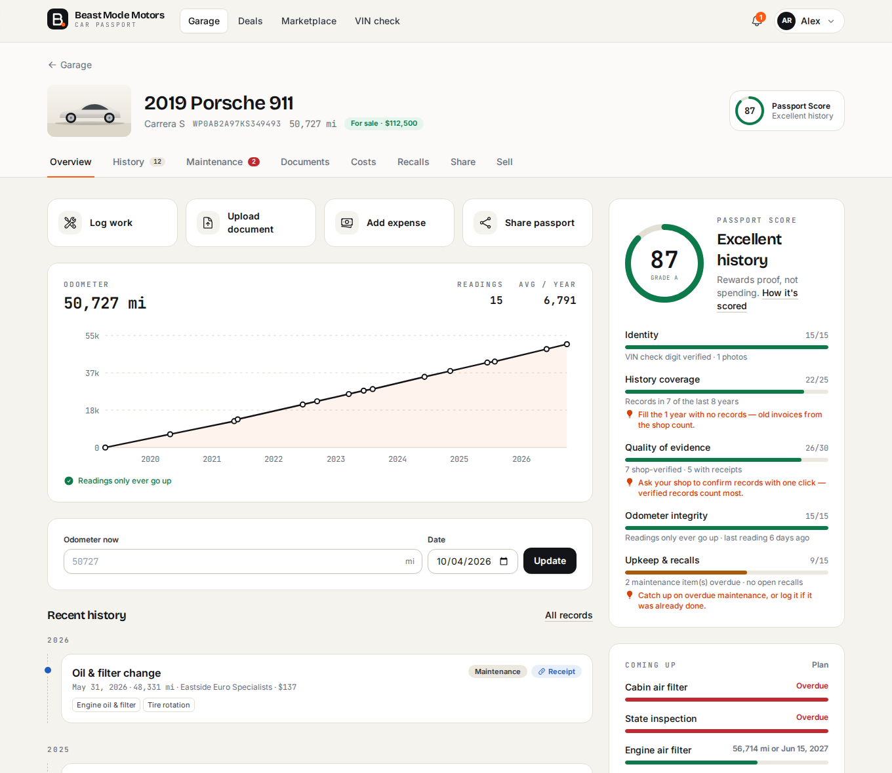 | 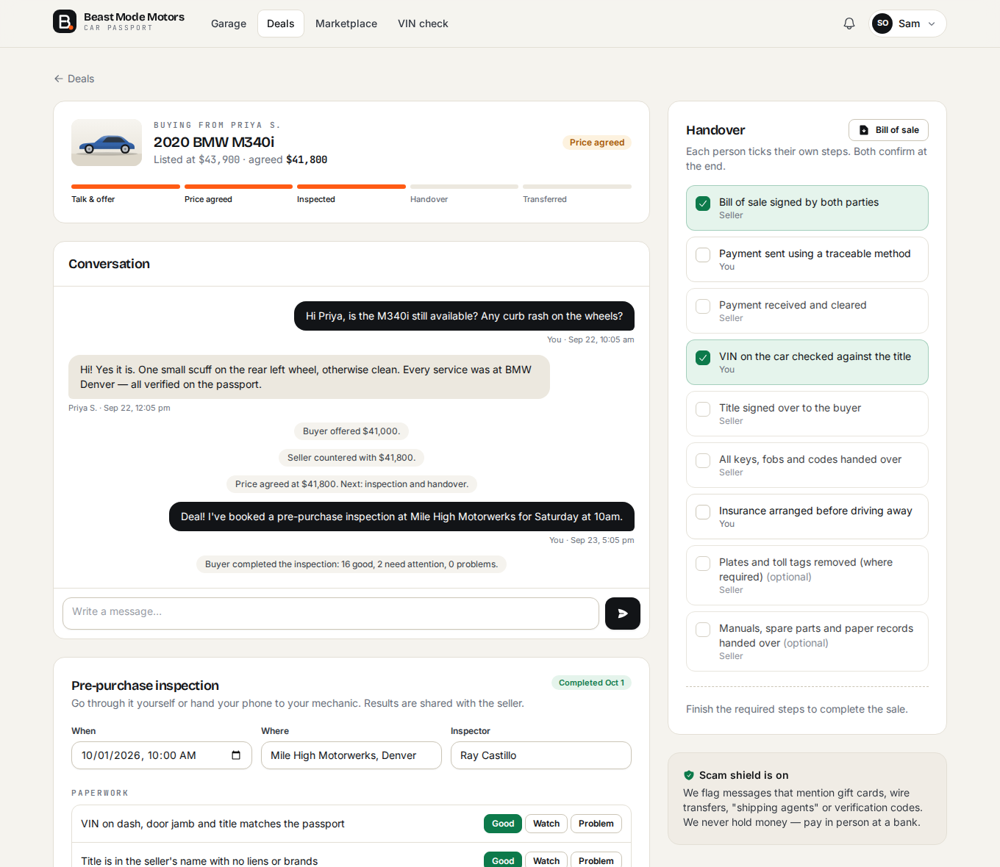 |

| Scam shield | Listing with its passport |
| --- | --- |
| 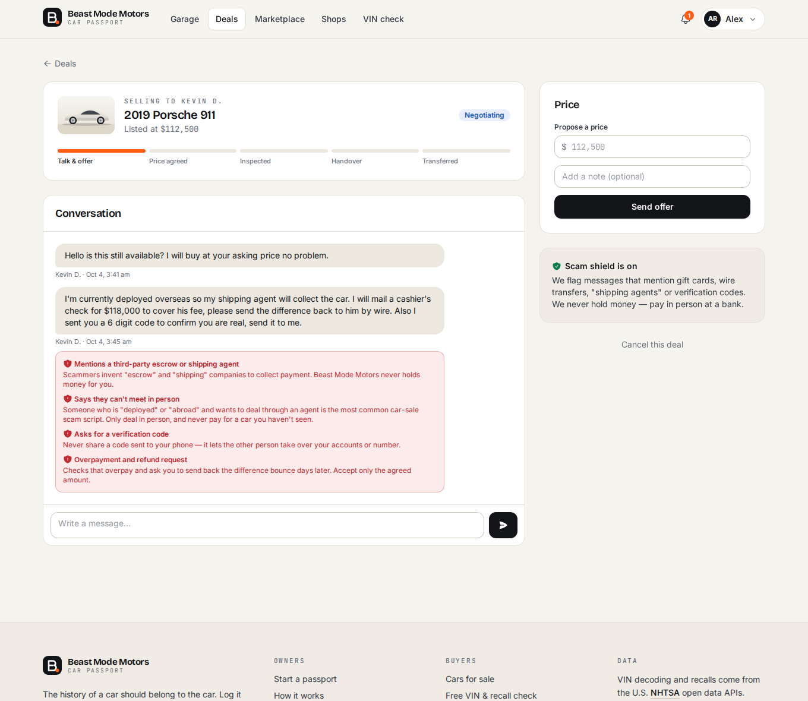 | 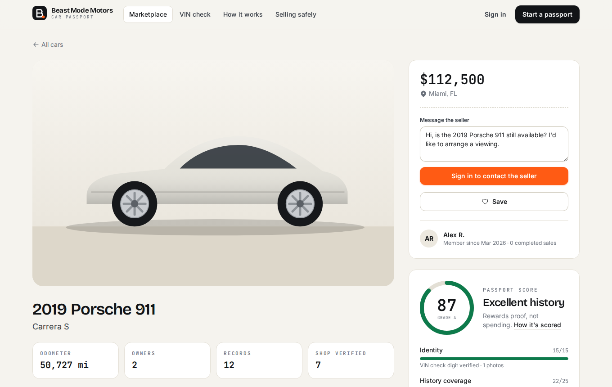 |

| Shop verification (no account needed) | Trust & safety console |
| --- | --- |
| 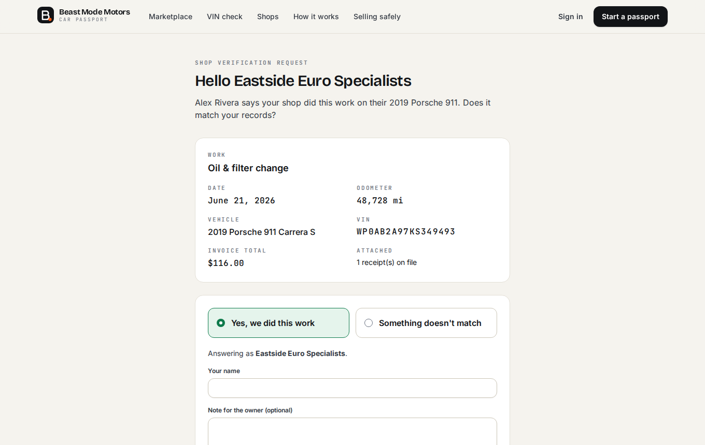 | 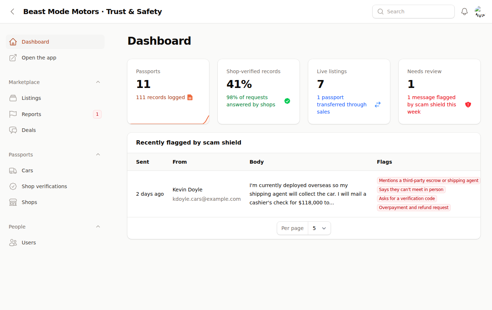 |

| Marketplace | Shop directory | Free VIN check |
| --- | --- | --- |
| 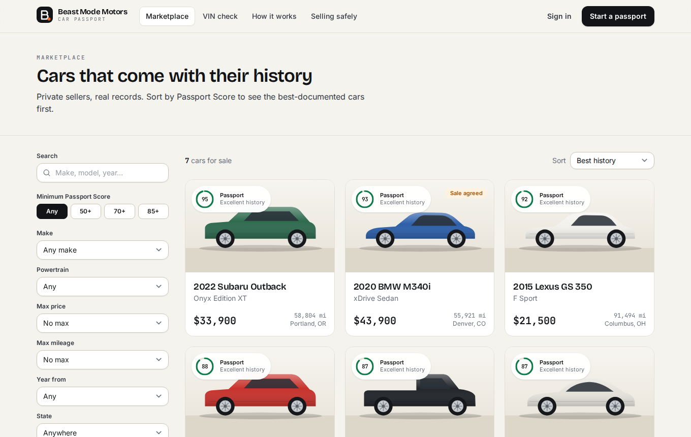 | 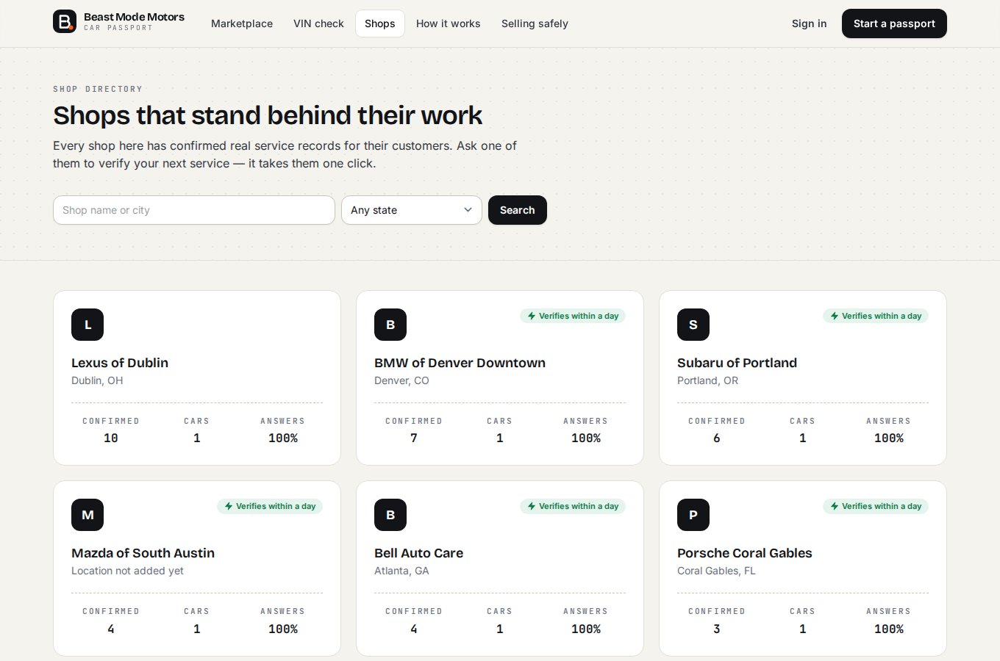 | 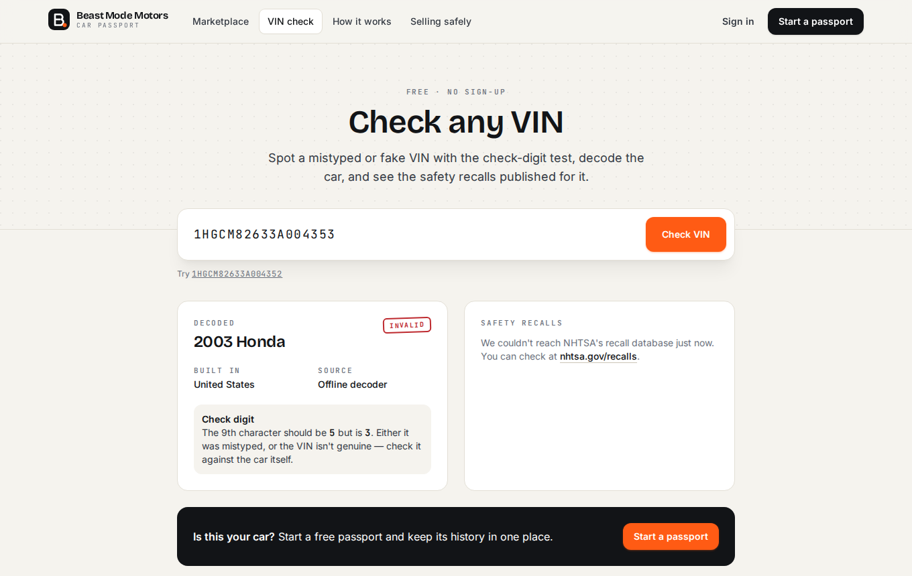 |

| Home | Service history |
| --- | --- |
| 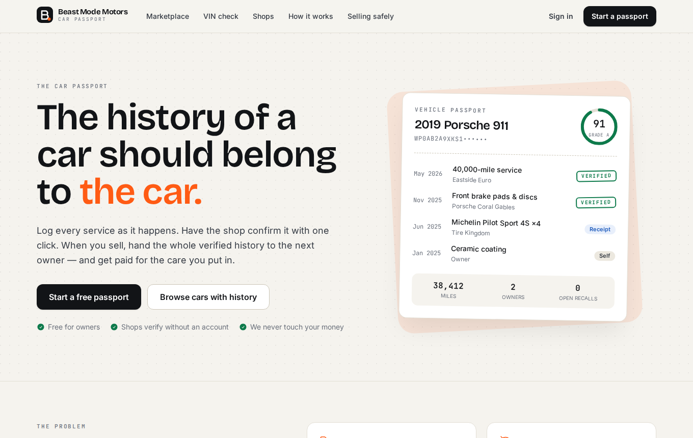 | 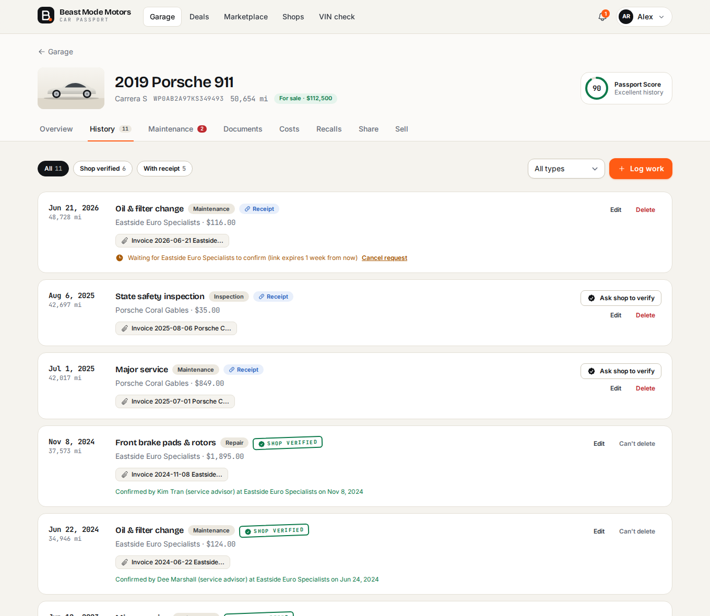 |

<p align="center">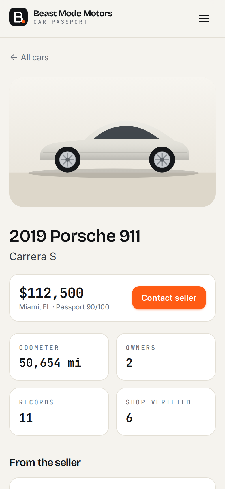</p>

> The demo cars use generated studio-style illustrations rather than photos, so the public demo never depends on third-party images. Real users upload their own photos.

## Try the demo

Run it locally (below) or deploy it. Every account's password is `password`:

| Account | What you'll see |
| --- | --- |
| `owner@beastmodemotors.test` | Three cars with multi-year histories, a Porsche for sale, a buyer countering, and a scammer the shield caught |
| `buyer@beastmodemotors.test` | A BMW deal mid-handover (inspection done, checklist half ticked) and an MX-5 bought through the platform |
| `admin@beastmodemotors.test` | The trust & safety console at `/admin` |

## Tech stack

| Layer | Choice |
| --- | --- |
| Framework | Laravel 12, PHP 8.3 |
| Interactivity | Livewire 4 + Alpine.js (no SPA build, no API layer) |
| Back-office | Filament 5 |
| Styling | Tailwind CSS 4 with design tokens; self-hosted Bricolage Grotesque, Inter and JetBrains Mono |
| Documents | DomPDF (passport report, bill of sale, odometer disclosure), BaconQrCode (window sign) |
| Receipt reading | Claude API via the official PHP SDK (`anthropic-ai/sdk`), structured JSON output |
| Data | NHTSA vPIC (VIN decoding) and Recalls APIs, both free and keyless |
| Database | SQLite (dev/demo); PostgreSQL in production — CI runs the full suite on both |
| Storage | Local disks in development; S3 or Cloudflare R2 in production |
| Testing | Pest 3 with Livewire and Filament test helpers (270 tests) |
| Delivery | GitHub Actions (Pint, Pest on PHP 8.3 and 8.4 and on PostgreSQL, Docker build), Docker (Nginx + PHP-FPM), Render blueprint |

## Getting started

Requirements: PHP 8.2+ with `intl`, `sqlite3` and `pdo_sqlite`; Composer 2; Node 20+.

```bash
git clone https://github.com/VRAJ8/BeastModeMotors.git
cd BeastModeMotors
composer setup        # deps, .env, SQLite database, migrate + seed demo data, build assets
composer dev          # app server, queue worker, log tail and Vite together
```

Open http://localhost:8000. Emails (shop verification requests, reminders, deal updates) go to `storage/logs/laravel.log`. Copy the signed link from a verification email into your browser to play the shop's side.

Useful commands:

```bash
php artisan demo:seed --fresh          # rebuild the demo (refuses unless DEMO_MODE=true, or --force)
php artisan passport:send-reminders    # maintenance & document-expiry emails (daily)
php artisan passport:sync-recalls      # NHTSA recall check (weekly)
php artisan passport:housekeeping      # expire stale offers and verification links, refresh listing scores (hourly)
php artisan test                       # 270 tests
vendor/bin/pint --test                 # code style
```

## Deployment

### One-click demo on Render (free)
1. Fork the repo. In Render choose **New → Blueprint** and select it; Render reads [`render.yaml`](render.yaml).
2. Set `APP_KEY` (from `php artisan key:generate --show`) and `APP_URL` (your Render URL).
3. Deploy. On first boot the container migrates and seeds the demo (`DEMO_MODE=true`).

The free plan has no persistent disk, so the demo resets on restart.

### Going live
[`docs/LAUNCH.md`](docs/LAUNCH.md) walks through a real launch step by step: Render with Postgres (using
[`render.production.yaml`](render.production.yaml)), Cloudflare R2 for files, Resend for email, your domain, and your
first admin account (`php artisan passport:make-admin you@example.com`).

### Production checklist
Everything is configured through environment variables (see [`.env.example`](.env.example)):

| Need | Setting |
| --- | --- |
| Persistent database | `DB_CONNECTION=pgsql` and `DB_URL` (e.g. Render PostgreSQL) |
| Receipts & photos that survive deploys | `DOCUMENTS_DISK=s3`, `PHOTOS_DISK=s3-public` and the `AWS_*` keys. Receipts go in the private `AWS_BUCKET`. For Cloudflare R2, or S3 buckets with ACLs disabled, put photos in a separate public bucket: `AWS_PUBLIC_BUCKET`, `AWS_PUBLIC_URL` and `AWS_PUBLIC_ACL=false` |
| Real email (shop verification needs it) | Any SMTP provider, e.g. Resend: `MAIL_MAILER=smtp`, `MAIL_HOST=smtp.resend.com`, `MAIL_PORT=465`, `MAIL_SCHEME=smtps`, `MAIL_USERNAME=resend`, `MAIL_PASSWORD=<api key>` |
| Emails, reminders, recall checks, expiry | Built in: the image runs a queue worker and the scheduler (`QUEUE_CONNECTION=database`). Running several web containers? Keep `RUN_SCHEDULER=true` on all of them (jobs take a lock) or on just one |
| Custom domain | Keep `APP_URL` on the main domain and list other hostnames in `TRUSTED_HOSTS` |
| Receipt scanning (optional) | `ANTHROPIC_API_KEY`. Uses `claude-opus-5-5` at low effort (`RECEIPT_SCANNER_MODEL`, `RECEIPT_SCANNER_EFFORT`), capped at `RECEIPT_SCANS_PER_DAY` per person |
| Turn off the demo | `DEMO_MODE=false` and `DEMO_NIGHTLY_RESET=false` |

### Any Docker host

```bash
docker build -t beast-mode-motors .
docker run -p 8080:8080 -e APP_KEY=base64:... -e APP_URL=http://localhost:8080 \
  -e DEMO_MODE=true -e MAIL_MAILER=log beast-mode-motors
```

The image is a multi-stage build: Vite assets, then `composer install --no-dev`, then Nginx + PHP-FPM with OPcache. On start it migrates, links storage and caches config. A queue worker (emails and in-app notifications, retried on failure) and the scheduler (reminders, recall checks, offer and request expiry) run in the same container under s6. If you run them elsewhere instead, set `RUN_QUEUE_WORKER=false` / `RUN_SCHEDULER=false`. The app only answers to `APP_URL`'s host and its subdomains: add any other names, such as an apex domain or the platform's own hostname, to `TRUSTED_HOSTS`.

## Architecture notes

- **All deal state changes go through `App\Services\DealFlow`.** That covers start, post, offer, counter, accept, cancel, handover and confirm. The Livewire deal room only calls it, so the rules live in one tested place.
- **`App\Services\OwnershipTransfer`** completes a sale in one transaction. It closes the old ownership with the handover odometer reading, opens the next one, deletes personal paperwork, revokes share links, and cancels other buyers' deals.
- **`App\Services\PassportScore`** is pure and explains itself. Each of its five components returns points, a detail line and a tip. Listings store a score snapshot for sorting, refreshed when viewed and hourly by housekeeping.
- **Email never decides whether something happened.** Every notification is queued to send after the database commits, so a bounced email can't roll back a sale. A verification email that fails frees the request for a resend.
- **`App\Services\AccountDeletion`** decides, per car, whether a passport is deleted or kept unowned, and is used by both the profile page and the admin.
- **Evidence is derived, not stored.** `ServiceRecord::evidence()` is computed from verification and dispute timestamps and attached receipts, so it can't drift out of sync.
- **Every service record is also an odometer reading** (a model hook keeps the two in step). `OdometerAnalyzer` finds readings that go backwards.
- **Shop verification uses Laravel signed URLs.** There are no tokens to store or leak, links expire, and the responder's name and IP are recorded with the answer.
- **Defence in depth on authorization.** Garage routes use the `can:manage,vehicle` middleware, Livewire tab components re-check ownership on every request (`ManagesVehicle` trait), model properties are `#[Locked]`, and documents stream from a private disk through policy-checked routes.
- **Offline-first VIN handling.** `VinDecoder` implements the ISO 3779 check digit, the 30-year model-year cycle and a manufacturer-code table. `Nhtsa` wraps the free APIs with caching and returns `null` on failure so callers fall back gracefully.
- **The scam shield is rule-based on purpose.** Every flag can be explained to a user in one sentence, and there are no false "AI says so" warnings.

## Project structure

```
app/
├── Console/Commands/     # send-reminders, sync-recalls, housekeeping, demo:seed
├── Enums/                # ServiceCategory, DocumentType, ListingStatus, DealStatus, … (Filament labels & colours)
├── Filament/             # Trust & safety console: resources and dashboard widgets
├── Http/Controllers/     # Garage, Vehicle tabs, Marketplace, Passport, Deal, ShopVerification, …
├── Livewire/             # AddVehicle, RecordForm, Vehicle/* tabs, Marketplace, DealRoom, VinCheck, …
├── Models/               # Vehicle, Ownership, ServiceRecord, Document, OdometerReading, Shop, Listing, Deal, Offer, …
├── Notifications/        # VerifyServiceRecord, VerificationAnswered, MaintenanceDue, RecallsFound, DealUpdate, …
├── Policies/             # VehiclePolicy, DealPolicy
├── Services/             # VinDecoder, Nhtsa, PassportScore, ScamShield, DealFlow, OwnershipTransfer, …
└── Support/              # QR codes, demo car illustrations, helpers
config/passport.php       # Maintenance schedules, inspection & handover checklists, NHTSA, verification
database/seeders/         # A believable demo world: 12 people, 11 cars, deals in every state
docs/PLAN.md              # Product plan, data model and roadmap
```

See **[docs/PLAN.md](docs/PLAN.md)** for the product thinking, the data model and what comes next.

## License

MIT
