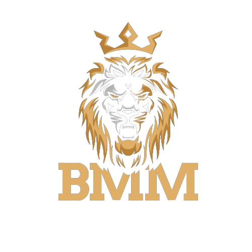
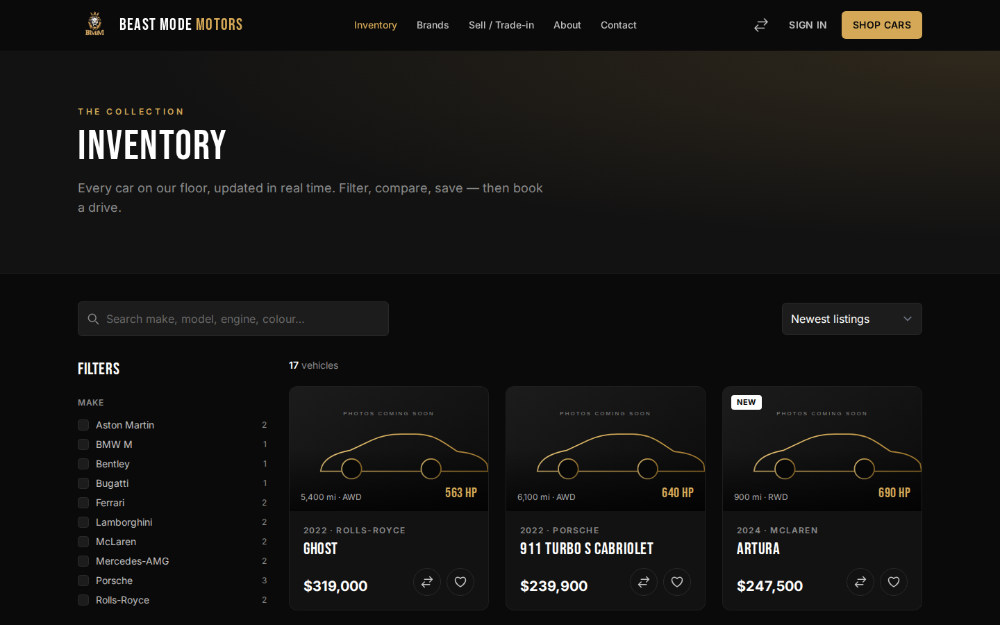
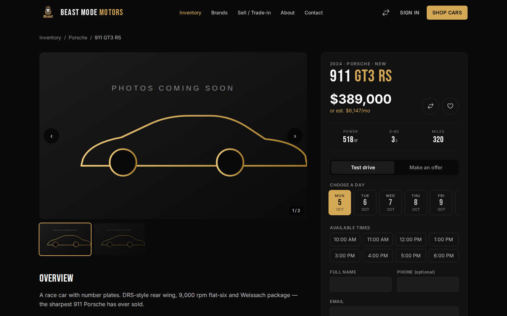
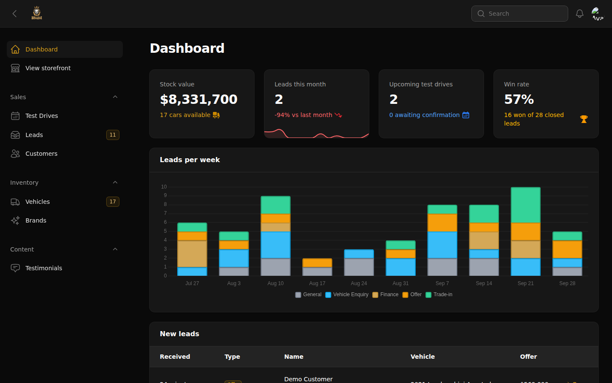
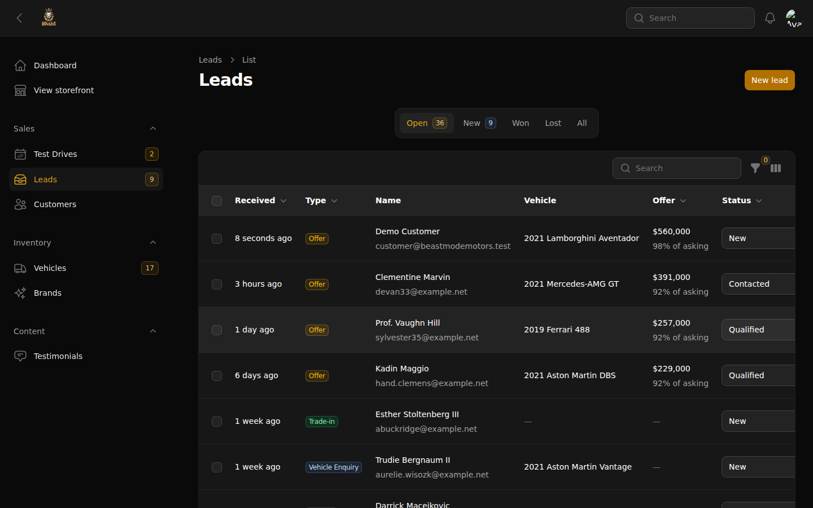
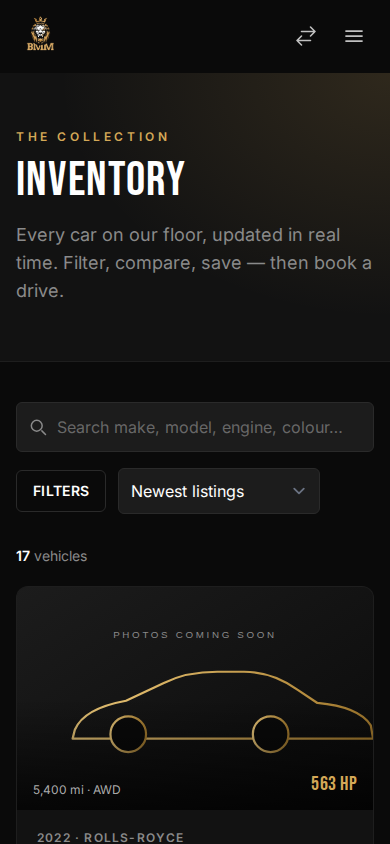

<p align="center">
  
</p>

<h1 align="center">Beast Mode Motors</h1>

<p align="center">
  A full-stack exotic &amp; performance car dealership platform: public showroom, customer accounts and a staff back-office.<br>
  Built entirely on the Laravel ecosystem.
</p>

<p align="center">
  
  
  
  
  
  
</p>


## Contents

- [Features](#features)
- [Screenshots](#screenshots)
- [Tech stack](#tech-stack)
- [Getting started](#getting-started)
- [Testing](#testing)
- [Deployment](#deployment)
- [Architecture notes](#architecture-notes)
- [Project structure](#project-structure)

## Features

### Showroom (public)
- **Live inventory search.** Livewire-powered filters for make, body style, condition, powertrain, price, year and horsepower, plus sorting and pagination. Every filter syncs to the URL, so searches can be shared and bookmarked.
- **Vehicle pages.** Photo gallery with lightbox, performance bars, full spec sheet, highlights, similar cars, a "price drop" badge, and `schema.org/Car` JSON-LD for rich search results.
- **Test-drive booking.** Shows real availability: opening hours, minimum notice, a 30-day booking window, closed Sundays, and already-booked slots removed. The customer gets a reference code and an email.
- **Make an offer.** Validated against the asking price (between 50% and 100%) and routed to the sales pipeline.
- **Finance calculator.** Adjust deposit, term and APR to see an amortised monthly payment. Listing cards show a monthly estimate.
- **Compare.** Put up to 3 cars side by side; the best figure in each row is highlighted.
- **Sell / trade-in.** A two-step form gives an instant *indicative* valuation (age, mileage and condition depreciation model) and creates a trade-in lead.
- **Brands, About, Contact, `sitemap.xml`, `robots.txt`, Open Graph tags.**

### My Garage (customers)
- Save cars with ♥. **When staff cut the price of a saved car, everyone who saved it gets an email and an in-app alert.**
- Upcoming and past test drives, with self-service cancellation.
- Status tracking for offers, enquiries and trade-in requests.
- Profile, password and account deletion (Breeze).

### Back-office (`/admin`, staff only)
- **Dashboard:** stock value, leads this month vs last month (with sparkline), upcoming test drives, win rate, a stacked leads-per-week chart, and a "new leads" inbox.
- **Vehicles:** full CRUD with photo uploads and external photo URLs, a "reduce price" action that triggers alerts, "mark as sold", featured toggle, filters and global search (<kbd>⌘K</kbd>).
- **Test drives:** Upcoming, Needs-confirmation and Past tabs; confirm, complete or cancel in one click. The customer is emailed on every change.
- **Leads pipeline:** general, vehicle, finance, offer and trade-in leads move through New → Contacted → Qualified → Won/Lost, with inline status editing and bulk updates.
- **Brands, Testimonials, Customers.**

### Engineering
- Honeypot field and per-visitor rate limiting on every public form.
- PHP backed enums for every status, shared by the storefront and Filament (labels and colours).
- Queued mail and database notifications.
- Money stored as whole dollars; eager loading throughout; database-agnostic queries (SQLite, MySQL, PostgreSQL).
- 86 Pest tests covering inventory filters, booking rules, notifications, forms, authorization and Filament actions.
- GitHub Actions CI: Pint, Pest on PHP 8.3 and 8.4, asset build, and a Docker image build.

## Screenshots

| Inventory | Vehicle page & booking |
| --- | --- |
|  |  |

| Back-office dashboard | Leads pipeline |
| --- | --- |
|  |  |

<p align="center"></p>

> The seeded inventory uses Unsplash photo URLs. If a photo can't load, a branded placeholder is shown instead (as in some of the screenshots above). Staff can upload real photos from the back-office.

## Tech stack

| Layer | Choice |
| --- | --- |
| Framework | Laravel 12 · PHP 8.3 |
| Interactivity | Livewire 4 + Alpine.js |
| Back-office | Filament 5 |
| Styling | Tailwind CSS 4 (CSS-first theme), self-hosted Bebas Neue + Inter |
| Auth | Laravel Breeze (Blade), restyled |
| Database | SQLite (dev / demo) · PostgreSQL or MySQL (production) |
| Testing | Pest 3, Livewire & Filament testing helpers |
| Tooling | Vite 7, Laravel Pint, GitHub Actions |
| Hosting | Docker (Nginx + PHP-FPM via `serversideup/php`), Render blueprint |

## Getting started

Requirements: PHP 8.2+ with `intl`, `sqlite3` and `pdo_sqlite`; Composer 2; Node 20+.

```bash
git clone https://github.com/VRAJ8/BeastModeMotors.git
cd BeastModeMotors
composer setup   # install deps, create .env + SQLite db, migrate + seed, build assets
composer dev     # app server, queue worker, log tail and Vite together
```

Open http://localhost:8000.

| Role | Email | Password |
| --- | --- | --- |
| Staff (`/admin`) | `admin@beastmodemotors.test` | `password` |
| Customer | `customer@beastmodemotors.test` | `password` |

To reset the demo data at any time, run `php artisan demo:seed --fresh`.

Emails are written to `storage/logs/laravel.log` by default (`MAIL_MAILER=log`).

## Testing

```bash
php artisan test           # 86 tests
vendor/bin/pint --test     # code style
```

## Deployment

### One-click demo on Render (free)

1. Fork this repo, then in Render choose **New → Blueprint** and select it. Render reads [`render.yaml`](render.yaml).
2. When prompted, set:
   - `APP_KEY` to the output of `php artisan key:generate --show`
   - `APP_URL` to your Render URL, e.g. `https://beast-mode-motors.onrender.com`
3. Deploy. On boot the container runs migrations and seeds the demo showroom (`DEMO_MODE=true`).

The free plan has no persistent disk, so the demo starts fresh after each restart. That suits a public demo where anyone can sign in as staff. For a persistent install, add a Render PostgreSQL database and set `DB_CONNECTION=pgsql` plus the `DB_*` variables.

### Any Docker host (Railway, Fly.io, a VPS…)

```bash
docker build -t beast-mode-motors .
docker run -p 8080:8080 \
  -e APP_KEY=base64:... -e APP_URL=http://localhost:8080 \
  -e DEMO_MODE=true -e QUEUE_CONNECTION=sync -e MAIL_MAILER=log \
  beast-mode-motors
```

The image is a multi-stage build: Vite assets → `composer install --no-dev` → Nginx + PHP-FPM with OPcache. On start it runs migrations, `storage:link` and config caching automatically.

### Laravel Cloud / Forge

Standard Laravel app: build with `composer install --no-dev && npm ci && npm run build`, deploy with `php artisan migrate --force`. Run a queue worker for queued mail, and the scheduler for the nightly demo reset.

## Architecture notes

- **`App\Services\TestDriveScheduler`** is the single source of truth for availability. The booking widget and the server-side validation both use it, so the UI can't offer a slot the server would reject, and a slot taken a moment earlier by someone else is caught on submit.
- **Price-drop alerts** live in the `Vehicle` model lifecycle. A lower price records `previous_price` and notifies everyone who saved the car, whether the change comes from the back-office form, the "reduce price" action or code.
- **Model events drive notifications:** a new `Lead` alerts the sales inbox, and a `TestDrive` status change emails the customer. Controllers and Livewire components stay thin.
- **`App\Support\CompareList`** keeps the compare list in the session, so guests can compare without an account.
- **`GuardsPublicForms`** is a Livewire trait that adds a honeypot, rate limiting and contact prefill for signed-in users to every public form.
- **Enums** (`app/Enums`) implement Filament's `HasLabel` and `HasColor`, so badges look the same in the storefront and the back-office.

## Project structure

```
app/
├── Enums/                 # BodyType, Condition, VehicleStatus, LeadType, LeadStatus, …
├── Filament/              # Back-office resources, pages and dashboard widgets
├── Http/Controllers/      # Home, Vehicle, Brand, Compare, Garage, Sitemap
├── Livewire/              # Inventory, BookTestDrive, MakeOffer, TradeInForm, ContactForm, …
├── Models/                # Brand, Vehicle, TestDrive, Lead, Testimonial, User
├── Notifications/         # PriceDropped, TestDriveUpdated, NewLeadReceived
├── Services/              # TestDriveScheduler, TradeInEstimator
└── Support/               # CompareList, Finance, helpers
config/dealership.php      # Showroom details, opening hours, finance defaults, demo mode
database/seeders/          # Realistic exotic-car line-up and demo activity
resources/views/           # Blade storefront, components and Livewire views
docs/PLAN.md               # Product plan and roadmap
```

See **[docs/PLAN.md](docs/PLAN.md)** for the product plan, the data model and the roadmap (Stripe deposits, Scout search, Reverb real-time features and more).

## License

MIT
